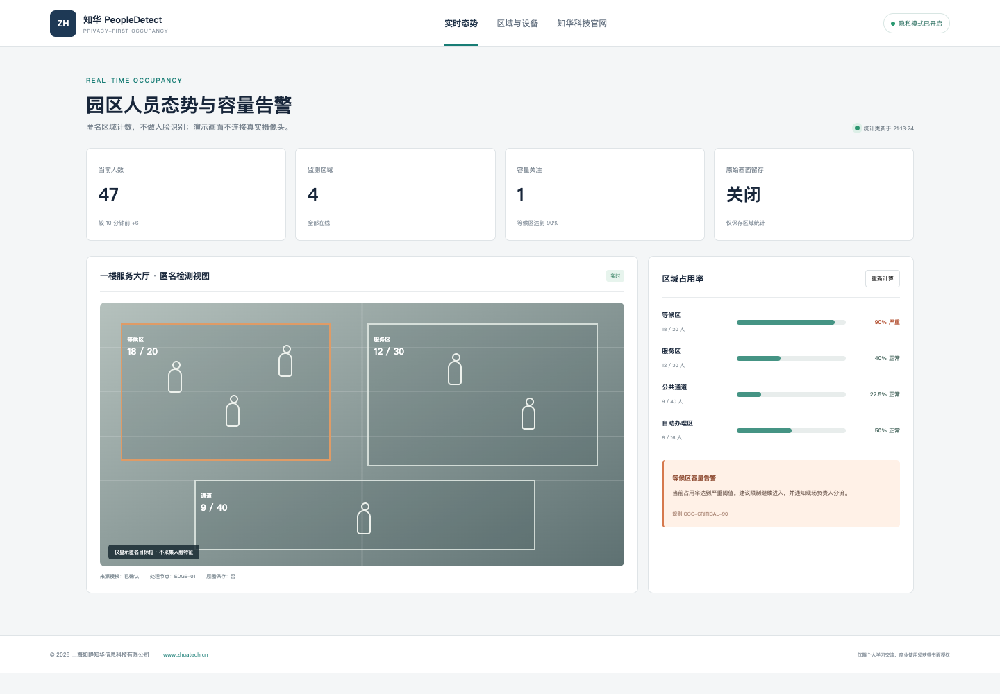

# ZhuaTech PeopleDetect｜知华科技隐私优先人员区域计数

ZhuaTech PeopleDetect 是上海如静知华信息科技有限公司开发的独立图像人员检测案例。项目聚焦公共区域的匿名人数统计、容量利用率和分级告警，默认不做人脸识别、不推断人员身份、不保存原始画面。

[知华科技官网](https://www.zhuatech.cn/) · `cn.zhuatech.peopledetect` · `POST /api/peopledetect/analyze`

## 功能

- 多区域人数、容量与占用率计算
- 正常、关注、严重三级业务规则
- 来源授权门禁与隐私模式提示
- 告警处置建议和区域统计留痕
- 实时监控大屏、区域管理、设备管理视图
- 预留目标检测 Provider，自行配置模型服务



本项目的本地引擎只处理前端或调用者提交的匿名数量，不读取摄像头。真实视觉检测、视频流接入和边缘部署属于生产扩展，应先完成合法性评估、明确告知、数据最小化、访问控制与保留期限配置。

## 启动

```bash
cd backend && mvn spring-boot:run
# 新终端
cd frontend && python3 -m http.server 8088
```

浏览器访问 `http://localhost:8088`。Docker 和 MySQL 示例分别见 `compose.yaml`、`database/schema.sql`。

## 许可

本工程仅限个人学习、研究和非商业交流，**不得商用**。商业部署、视觉模型接入、边缘计算、私有化或深度开发须取得上海如静知华信息科技有限公司书面授权，详见 [LICENSE](LICENSE)。

| 微信咨询一 | 微信咨询二 |
| --- | --- |
|  |  |

SEO：人员检测源码、人数统计系统、区域人数告警、客流统计、Java 目标检测、隐私计算机视觉、知华科技。
